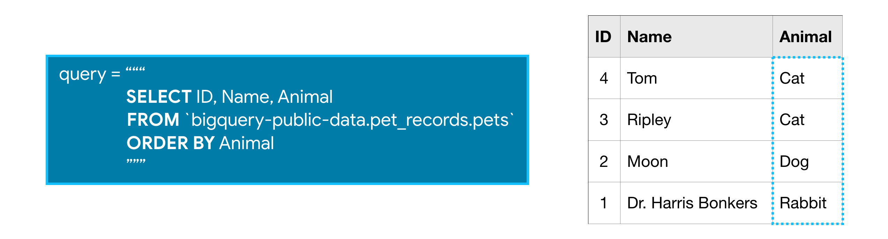
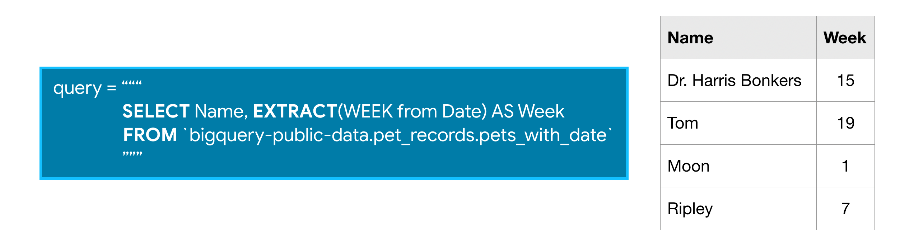

# **Kaggle SQL**

**Structured Query Language**

## Course #1 -> **Getting Started With SQL and BigQuery**

We'll use BigQuery to build our SQL skills
<mark>**BigQuery**</mark>: a web service that lets you apply SQL to huge datasets.

<pre><code>from google.cloud import bigquery</code></pre>

- First step in the **BigQuery** workflow is: Creating a <code>Client</code> object. This <code>Client</code> object will play a central role in retrieving information from BigQuery datasets.

<pre><code>client = bigquery.Client()</code></pre>

- In BigQuery, each dataset is contained in a corresponding project. In this case, our <code>hacker_news</code> dataset is contained in the <code>bigquery-public-data</code> project. To access the dataset,
  - We begin by constructing a reference to the dataset with the <code>dataset()</code> method.
  - Next, we use the <code>get_dataset()</code> method, along with the reference we just constructed, to fetch the dataset.

<pre>
<code>dataset_ref = client.dataset("hacker_news", project = "bigquery-public-data")</code>
<code>dataset = client.get_dataset(dataset_ref)</code>
</pre>

Every dataset is just a collection of tables. You can think of a dataset as a spreadsheet file containing multiple tables, all composed of rows and columns.

We use the <code>list_tables()</code> method to list the tables in the dataset.

<pre>
# List all the tables in the "hacker_news" dataset
<code>tables = list(client.list_tables(dataset))</code>

# Print names of all tables in the dataset (there are four!)
<code>for table in tables:</code>
<code>  print(table.table_id)</code>
</pre>

Similar to how we fetched a dataset, we can fetch a table. In the code cell below, we fetch the <code>full</code> table in the <code>hacker_news</code> dataset.

<pre>
<code>table_ref = dataset_ref.table("full")</code>
<code>table = client.get_table(table_ref)</code>
</pre>


#### **Table schema**

The structure of a table is called its **schema**. We need to understand a table's schema to effectively pull out the data we want.

In this example, we'll investigate the `full` table that we fetched above.

<pre>
# Print information on all the columns in the "full" table in the "hacker_news" dataset
<code>table.schema</code>
</pre>

Each `SchemaField` tells us about a specific column (which we also refer to as a **field**). In order, the information is:

- The **name** of the column
- The **field** type (or datatype) in the column
- The **mode** of the column (`'NULLABLE'` means that a column allows NULL values, and is the default)
- A **description** of the data in that column

Viewing `table`:

```
# Preview the first five lines of the "full" table
client.list_rows(table, max_results=5).to_dataframe()
```

Viewing especific `columns`:

```
# Preview the first five entries in the "by" column of the "full" table
client.list_rows(table, selected_fields=table.schema[:1], max_results=5).to_dataframe()
```

---

## Course #2 -> Select, From & Where

### **Introduction**

Let's begin with basic keywords **SELECT**, **FROM**, and **WHERE** to get data from specific columns based on conditions you specify.

We'll work with a small imaginary dataset `pet_records` which contains just one table, called `pets`.


### **SELECT ... FROM**

The most basic SQL query selects a single column from a single table. To do this,

- specify the column you want after the word **SELECT**, and then
- specify the table after the word **FROM**.

For instance, to select the `Name` column (from the `pets` table in the `pet_records` database in the `bigquery-public-data` project), our query would appear as follows:


##### Note that when writing an SQL query, the argument we pass to **FROM** is not in single or double quotation marks (' or "). It is in <mark>**backticks (`)**</mark>.

### **WHERE ...**

BigQuery datasets are large, so you'll usually want to return only the rows meeting specific conditions. You can do this using the **WHERE** clause.

The query below returns the entries from the `Name` column that are in rows where the `Animal` column has the text `'Cat'`.


### Example: What are all the U.S. cities in the OpenAQ dataset?

Now that you've got the basics down, let's work through an example with a real dataset. We'll use an OpenAQ dataset about air quality.

First, we'll set up everything we need to run queries and take a quick peek at what tables are in our database.

```
from google.cloud import bigquery

# Create a "Client" object
client = bigquery.Client()

# Construct a reference to the "openaq" dataset
dataset_ref = client.dataset("openaq", project="bigquery-public-data")

# API request - fetch the dataset
dataset = client.get_dataset(dataset_ref)

# List all the tables in the "openaq" dataset
tables = list(client.list_tables(dataset))

# Print names of all tables in the dataset (there's only one!)
for table in tables:
    print(table.table_id)
```

The dataset contains only one table, called `global_air_quality`. We'll fetch the table and take a peek at the first few rows to see what sort of data it contains.

Everything looks good! So, let's put together a query. Say we want to select all the values from the `city` column that are in rows where the `country` column is `'US'` (for "United States").

```
# Query to select all the items from the "city" column where the "country" column is 'US'
query = """
        SELECT city
        FROM `bigquery-public-data.openaq.global_air_quality`
        WHERE country = 'US'
        """
```

### Submitting the query to the dataset

```
# Create a "Client" object
client = bigquery.Client()

# Set up the query
query_job = client.query(query)

# API request - run the query, and return a pandas DataFrame
us_cities = query_job.to_dataframe()

# What five cities have the most measurements?
us_cities.city.value_counts().head()
```

### More queries

If you want multiple columns, you can select them with a comma between the names:

```
query = """
        SELECT city, country
        FROM `bigquery-public-data.openaq.global_air_quality`
        WHERE country = 'US'
        """
```

You can select all columns with a `*` like this:

```
query = """
        SELECT *
        FROM `bigquery-public-data.openaq.global_air_quality`
        WHERE country = 'US'
        """
```

### Q&A: Notes on formatting

**Question: What's up with the triple quotation marks (""")?**
Answer: These tell Python that everything inside them is a single string, even though we have line breaks in it. The line breaks aren't necessary, but they make it easier to read your query.

**Question: Do you need to capitalize SELECT and FROM?**
Answer: No, SQL doesn't care about capitalization. However, it's customary to capitalize your SQL commands, and it

### Working with big datasets

To begin,you can estimate the size of any query before running it. Here is an example using the (very large!) Hacker News dataset. To see how much data a query will scan, we create a `QueryJobConfig` object and set the `dry_run` parameter to `True`.

```
# Query to get the score column from every row where the type column has value "job"
query = """
        SELECT score, title
        FROM `bigquery-public-data.hacker_news.full`
        WHERE type = "job"
        """

# Create a QueryJobConfig object to estimate size of query without running it
dry_run_config = bigquery.QueryJobConfig(dry_run=True)

# API request - dry run query to estimate costs
dry_run_query_job = client.query(query, job_config=dry_run_config)

print("This query will process {} bytes.".format(dry_run_query_job.total_bytes_processed))
```

### The `DISTINCT` keyword ensures each column shows up once:

```
SELECT DISTINCT column_name
FROM dataset_name
WHERE condition
```

---

## Course #3 -> Group By, Having & Count

### Introduction

Now that you can select raw data, you're ready to learn how to group your data and count things within those groups. This can help you answer questions like:

- How many of each kind of fruit has our store sold?
- How many species of animal has the vet office treated?
  To do this, you'll learn about three new techniques: **GROUP BY**, **HAVING** and **COUNT()**. Once again, we'll use this made-up table of information on pets.


### **COUNT()**

**COUNT()**, as you may have guessed from the name, returns a count of things. If you pass it the name of a column, it will return the number of entries in that column.

For instance, if we **SELECT** the **COUNT()** of the `ID` column in the `pets` table, it will return 4, because there are 4 ID's in the table.


**COUNT()** is an example of an **aggregate function**, which takes many values and returns one. (Other examples of aggregate functions include **SUM()**, **AVG()**, **MIN()**, and **MAX()**.) As you'll notice in the picture above, aggregate functions introduce strange column names (like `f0__`). Later in this tutorial, you'll learn how to change the name to something more descriptive.

### **GROUP BY**

**GROUP BY** takes the name of one or more columns, and treats all rows with the same value in that column as a single group when you apply aggregate functions like **COUNT()**.

For example, say we want to know how many of each type of animal we have in the `pets` table. We can use **GROUP BY** to group together rows that have the same value in the `Animal` column, while using **COUNT()** to find out how many ID's we have in each group.


It returns a table with three rows (one for each distinct animal). We can see that the `pets` table contains 1 rabbit, 1 dog, and 2 cats.

**GROUP BY ... HAVING**
**HAVING** is used in combination with **GROUP BY** to ignore groups that don't meet certain criteria.

So this query, for example, will only include groups that have more than one ID in them.


Since only one group meets the specified criterion, the query will return a table with only one row.

### Example: Which Hacker News comments generated the most discussion?

Ready to see an example on a real dataset? The Hacker News dataset contains information on stories and comments from the Hacker News social networking site.

We'll work with the `comments` table and begin by printing the first few rows.

```
from google.cloud import bigquery

# Create a "Client" object
client = bigquery.Client()

# Construct a reference to the "hacker_news" dataset
dataset_ref = client.dataset("hacker_news", project="bigquery-public-data")

# API request - fetch the dataset
dataset = client.get_dataset(dataset_ref)

# Construct a reference to the "comments" table
table_ref = dataset_ref.table("comments")

# API request - fetch the table
table = client.get_table(table_ref)

# Preview the first five lines of the "comments" table
client.list_rows(table, max_results=5).to_dataframe()
```

Let's use the table to see which comments generated the most replies. Since:

- the `parent` column indicates the comment that was replied to, and
- the `id` column has the unique ID used to identify each comment,

we can **GROUP BY** the `parent` column and **COUNT()** the `id` column in order to figure out the number of comments that were made as responses to a specific comment.

Furthermore, since we're only interested in popular comments, we'll look at comments with more than ten replies. So, we'll only return groups **HAVING** more than ten ID's.

```
# Query to select comments that received more than 10 replies
query_popular = """
                SELECT parent, COUNT(id)
                FROM `bigquery-public-data.hacker_news.comments`
                GROUP BY parent
                HAVING COUNT(id) > 10
                """
```

### Let's run the query :)

```
# Set up the query (cancel the query if it would use too much of
# your quota, with the limit set to 10 GB)
safe_config = bigquery.QueryJobConfig(maximum_bytes_billed=10**10)
query_job = client.query(query_popular, job_config=safe_config)

# API request - run the query, and convert the results to a pandas DataFrame
popular_comments = query_job.to_dataframe()

# Print the first five rows of the DataFrame
popular_comments.head()
```

### Aliasing and other improvements

A couple hints to make your queries even better:

- The column resulting from `COUNT(id)` was called `f0__`. That's not a very descriptive name. You can change the name by adding AS `NumPosts` after you specify the aggregation. This is called **aliasing**, and it will be covered in more detail in an upcoming lesson.
- If you are ever unsure what to put inside the **COUNT()** function, you can do `COUNT(1)` to count the rows in each group. Most people find it especially readable, because we know it's not focusing on other columns. It also scans less data than if supplied column names (making it faster and using less of your data access quota).

```
# Improved version of earlier query, now with aliasing & improved readability
query_improved = """
                 SELECT parent, COUNT(1) AS NumPosts
                 FROM `bigquery-public-data.hacker_news.comments`
                 GROUP BY parent
                 HAVING COUNT(1) > 10
                 """

safe_config = bigquery.QueryJobConfig(maximum_bytes_billed=10**10)
query_job = client.query(query_improved, job_config=safe_config)

# API request - run the query, and convert the results to a pandas DataFrame
improved_df = query_job.to_dataframe()

# Print the first five rows of the DataFrame
improved_df.head()
```

---

## Course #4 -> Order By 😎

##### Order your results to focus on the most important data for your use case.

#### Introduction

**Quick Recap**:

- `SELECT` to pull specific columns from a table
- `WHERE` to pull rows that meet specified criteria
- `COUNT()` as aggregate functions along with `GROUP BY` to treat multiple rows as a single group.

Let's back to pets table :)


**ORDER BY**
**ORDER BY** is **usually the last clause in your query**, and it sorts the results returned by the rest of your query.

- Notice that the rows are not ordered by the `ID` column. for ordering `ID`:


- The **ORDER BY** can order in <mark>**alphabetical order**</mark>.



- for reverse ordering: `DESC` argument (short for 'descending'). The next query sorts the table by the Animal column, where the values that are last in alphabetic order are returned first.


### **Dates**

**Dates** are frequently used in real-world databases. There are two ways that dates can be stored in BigQuery: as a **DATE** or as a **DATETIME**.

The **DATE** format has the year first, then the month, and then the day. It looks like this:

<pre><code>
YYYY-[M]M-[D]D
</code></pre>

- `YYYY`: Four-digit year
- `[M]M`: One or two digit month
- `[D]D`: One or two digit day

So `2019-01-10` is interpreted as January 10, 2019.

- The **DATETIME** format is like the **DATE** format ... but with time added at the end.

### **EXTRACT**

Often you'll want to look at part of a date, like the year or the day. You can do this with **EXTRACT**. Imaging we have:


- The query below returns two columns, where column `Day` contains the day corresponding to each entry the `Date` column from the `pets_with_date` table:


- The query below returns one column with just the week in the year (between 1 and 53) for each date in the `Date` column:



- See more in BigQuery documentation in : ["Date and time functions"](https://cloud.google.com/bigquery/docs/reference/legacy-sql#datetimefunctions)

### Example: Which day of the week has the most fatal motor accidents?

Let's use the US Traffic Fatality Records database, which contains information on traffic accidents in the US where at least one person died.

We'll investigate the `accident_2015` table. Here is a view of the first few rows.

```
from google.cloud import bigquery

# Create a "Client" object
client = bigquery.Client()

# Construct a reference to the "nhtsa_traffic_fatalities" dataset
dataset_ref = client.dataset("nhtsa_traffic_fatalities", project="bigquery-public-data")

# API request - fetch the dataset
dataset = client.get_dataset(dataset_ref)

# Construct a reference to the "accident_2015" table
table_ref = dataset_ref.table("accident_2015")

# API request - fetch the table
table = client.get_table(table_ref)

# Preview the first five lines of the "accident_2015" table
client.list_rows(table, max_results=5).to_dataframe()
```

Let's use the table to determine how the number of accidents varies with the day of the week. Since:

- the `consecutive_number` column contains a unique ID for each accident, and
- the `timestamp_of_crash` column contains the date of the accident in `DATETIME` format

we can:

- `EXTRACT` the day of the week (as `day_of_week` in the query below) from the `timestamp_of_crash` column
- `GROUP BY` the day of the week, before we `COUNT` the `consecutive_number` column to determine the number of accidents for each day of the week.
- Then we sort the table with an `ORDER BY` clause, so the days with the most accidents are returned first.

```
# Query to find out the number of accidents for each day of the week
query = """
        SELECT COUNT(consecutive_number) AS num_accidents,
               EXTRACT(DAYOFWEEK FROM timestamp_of_crash) AS day_of_week
        FROM `bigquery-public-data.nhtsa_traffic_fatalities.accident_2015`
        GROUP BY day_of_week
        ORDER BY num_accidents DESC
        """

# Set up the query (cancel the query if it would use too much of
# your quota, with the limit set to 1 GB)
safe_config = bigquery.QueryJobConfig(maximum_bytes_billed=10**9)
query_job = client.query(query, job_config=safe_config)

# API request - run the query, and convert the results to a pandas DataFrame
accidents_by_day = query_job.to_dataframe()

# Print the DataFrame
accidents_by_day
```

- <mark>**Order**</mark> of sql syntax:

```
sample_query = """
                SELECT _____
                FROM `bigquery-public-data.world_bank_intl_education.international_education`
                WHERE ____
                GROUP BY ____
                ORDER BY ____
               """
```

- <mark>**sample_query #1**</mark>

```
sample_query = """
                SELECT country_name, AVG(value) AS avg_ed_spending_pct
                FROM `bigquery-public-data.world_bank_intl_education.international_education`
                WHERE indicator_code = 'SE.XPD.TOTL.GD.ZS' and year >= 2010 and year <= 2017
                GROUP BY country_name
                ORDER BY avg_ed_spending_pct DESC
               """
```

- <mark>**sample_query #2**</mark>

```
sample_query = """
                SELECT country_name, AVG(value) as avg_ed_spending_pct
                FROM `bigquery-public-data.world_bank_intl_education.international_education`
                WHERE (indicator_code = 'SE.XPD.TOTL.GD.ZS' AND year BETWEEN 2010 AND 2017)
                GROUP BY country_name
                ORDER BY avg_ed_spending_pct DESC
               """
```

- <mark>**sample_query #3**</mark>

```
sample_query = """
                   SELECT indicator_code, indicator_name, COUNT(1) AS num_rows
                   FROM `bigquery-public-data.world_bank_intl_education.international_education`
                   WHERE year = 2016
                   GROUP BY indicator_name, indicator_code
                   HAVING COUNT(1) >= 175
                   ORDER BY COUNT(1) DESC
                """
```

***
## Course #5 -> As & With 🤠

##### Organize your query for better readability. This becomes especially important for complex queries.

#### Introduction